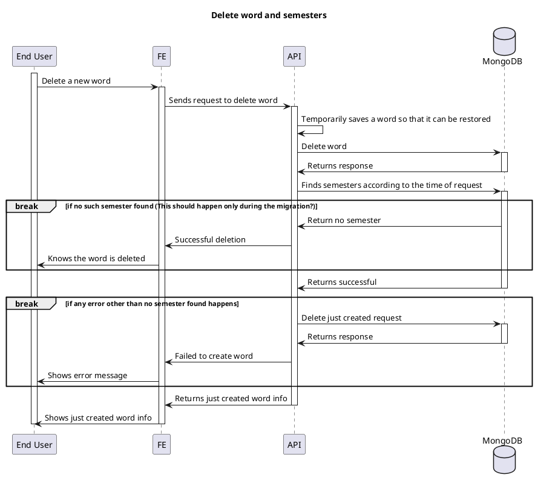

# Delete word and semesters

<!-- TOC -->

- [Delete word and semesters](#delete-word-and-semesters)
  - [Overview](#overview)

<!-- /TOC -->

## Overview

TODO: More detailed delete word process

```plantuml

@startuml

title Delete word and semesters

participant "End User" as user
participant "FE" as fe
participant "API" as api
database "MongoDB" as db

activate user
  user -> fe: Delete a new word
  activate fe
    fe -> api: Sends request to delete word
    activate api
      api -> api: Temporarily saves a word so that it can be restored
      api -> db: Delete word
      activate db
        api <- db: Returns response
      deactivate db
      api -> db: Finds semesters according to the time of request
      activate db
        break if no such semester found (This should happen only during the migration?)
        api <- db: Return no semester
        fe <- api: Successful deletion
        user <- fe: Knows the word is deleted
        end break
        api <- db: Returns successful
      deactivate db
      break if any error other than no semester found happens
        api -> db: Delete just created request 
          activate db
            api <- db: Returns response
          deactivate db
        fe <- api: Failed to create word
        user <- fe: Shows error message
        end break
      fe <- api: Returns just created word info
    deactivate api
    user <- fe: Shows just created word info
  deactivate fe
deactivate user


```
