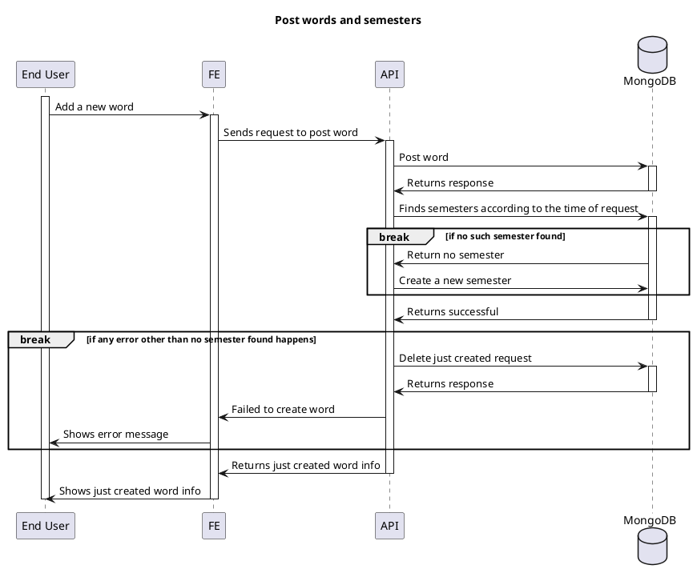

# Post words and semesters

<!-- TOC -->

- [Post words and semesters](#post-words-and-semesters)
  - [Overview](#overview)

<!-- /TOC -->

## Overview

```plantuml

@startuml

title Post words and semesters

participant "End User" as user
participant "FE" as fe
participant "API" as api
database "MongoDB" as db

activate user
  user -> fe: Add a new word
  activate fe
    fe -> api: Sends request to post word
    activate api
      api -> db: Post word
      activate db
        api <- db: Returns response
      deactivate db
      api -> db: Finds semesters according to the time of request
      activate db
        break if no such semester found
        api <- db: Return no semester
        api -> db: Create a new semester
        end break
        api <- db: Returns successful
      deactivate db
      break if any error other than no semester found happens
        api -> db: Delete just created request 
          activate db
            api <- db: Returns response
          deactivate db
        fe <- api: Failed to create word
        user <- fe: Shows error message
        end break
      fe <- api: Returns just created word info
    deactivate api
    user <- fe: Shows just created word info
  deactivate fe
deactivate user


```
