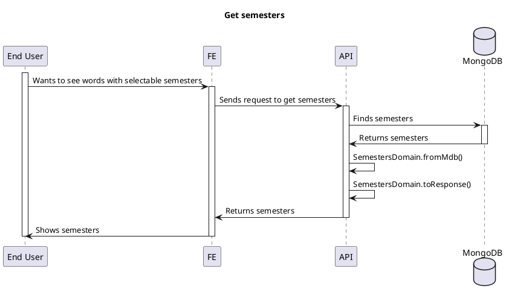

# Semesters

<!-- TOC -->

- [Semesters](#semesters)
  - [Overview](#overview)
  - [Semesters Data are modified under the following conditions](#semesters-data-are-modified-under-the-following-conditions)
    - [Word Posted](#word-posted)
    - [Word Deleted](#word-deleted)
  - [Semesters Data are NOT modified under the following condition](#semesters-data-are-not-modified-under-the-following-condition)
    - [Word sem is modified (word sem cannot be modified)](#word-sem-is-modified-word-sem-cannot-be-modified)
  - [Get semesters](#get-semesters)

<!-- /TOC -->

## Overview

`Semesters` is like a group for a chunk of words in three months.

## Semesters Data are modified under the following conditions

### Word Posted

TODO: Link a plantuml diagram after standard doc path is set after release

### Word Deleted

TODO: Link a plantuml diagram after standard doc path is set after release

## Semesters Data are NOT modified under the following condition

### Word sem is modified (word sem cannot be modified)

You may copy (POST) and delete, instead of modifying it.

## Get semesters

