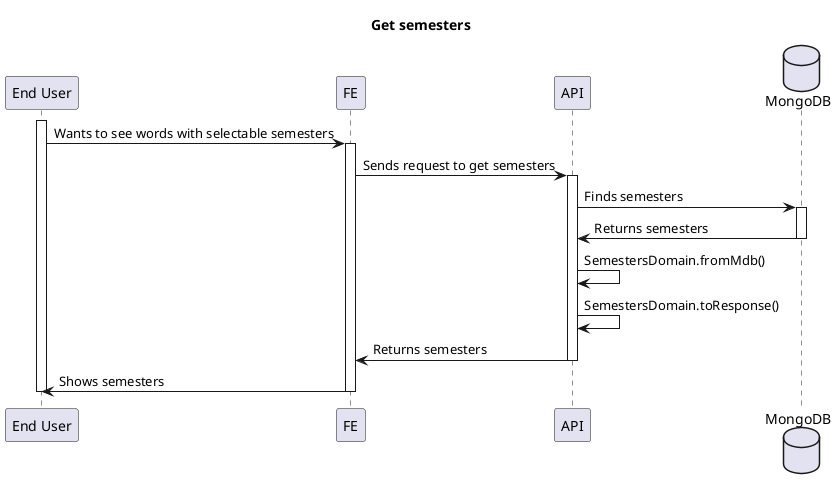

# Semesters

<!-- TOC -->

- [Semesters](#semesters)
  - [Overview](#overview)
  - [Semesters Data are modified under the following conditions](#semesters-data-are-modified-under-the-following-conditions)
    - [Word Posted](#word-posted)
    - [Word Gets returns empty string array](#word-gets-returns-empty-string-array)
  - [Semesters Data are NOT modified under the following condition](#semesters-data-are-not-modified-under-the-following-condition)
    - [Word sem is modified (word sem cannot be modified)](#word-sem-is-modified-word-sem-cannot-be-modified)
  - [Get semesters](#get-semesters)

<!-- /TOC -->

## Overview

`Semesters` is like a group for a chunk of words in three months.

## Semesters Data are modified under the following conditions

Deleting a word won't immediately delete the semester, even if semester no longer has any word data.

### Word Posted

When word is newly posted, it gets semester and simply add the semester without duplicate.

Then it will update the semester along with addedWordCount.

TODO: Link a plantuml diagram after standard doc path is set after release

### Word Gets returns empty string array

When end user requests for words with specific semester only for query, if the result is empty

Then the requested semester should be deleted.

TODO: Link a plantuml diagram after standard doc path is set after release

## Semesters Data are NOT modified under the following condition

### Word sem is modified (word sem cannot be modified)

You may copy (POST) and delete, instead of modifying it.

Even if it is modified, it will be ignored.

## Get semesters

