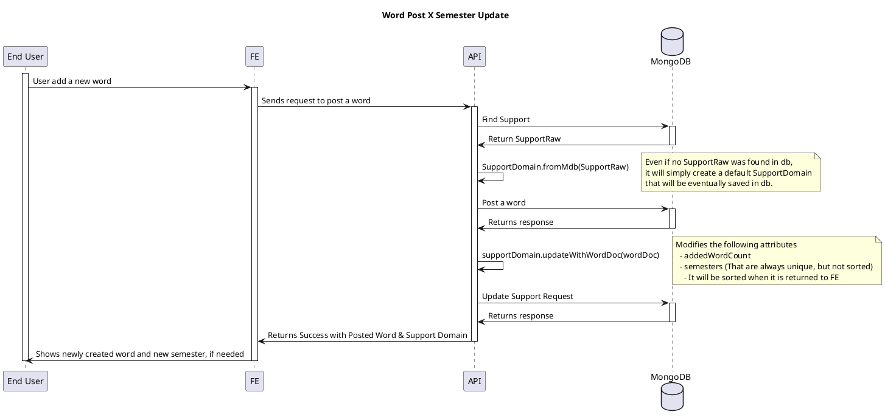
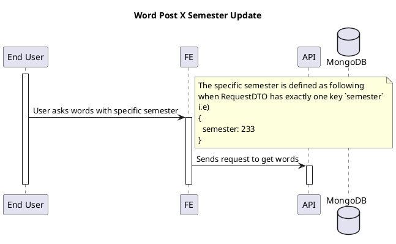

# Semesters

<!-- TOC -->

- [Semesters](#semesters)
  - [Overview](#overview)
  - [Semesters Data are modified under the following conditions](#semesters-data-are-modified-under-the-following-conditions)
    - [Word Post X Semester Update](#word-post-x-semester-update)
    - [Word Get X Potential Semester Delete](#word-get-x-potential-semester-delete)
  - [Semesters Data are NOT modified under the following condition](#semesters-data-are-not-modified-under-the-following-condition)
    - [Word sem is modified (word sem cannot be modified)](#word-sem-is-modified-word-sem-cannot-be-modified)

<!-- /TOC -->

## Overview

`Semesters` is like a group for a chunk of words in three months.

## Semesters Data are modified under the following conditions

Deleting a word won't immediately delete the semester, even if semester no longer has any word data.

### Word Post X Semester Update

When word is newly posted, it gets semester and simply add the semester without duplicate.

Then it will update the semester along with addedWordCount.

### Word Get X Potential Semester Delete

When end user requests for words with specific semester only for query, if the result is empty

Then the requested semester should be deleted.

## Semesters Data are NOT modified under the following condition

### Word sem is modified (word sem cannot be modified)

You may copy (POST) and delete, instead of modifying it.

Even if it is modified, it will be ignored.
