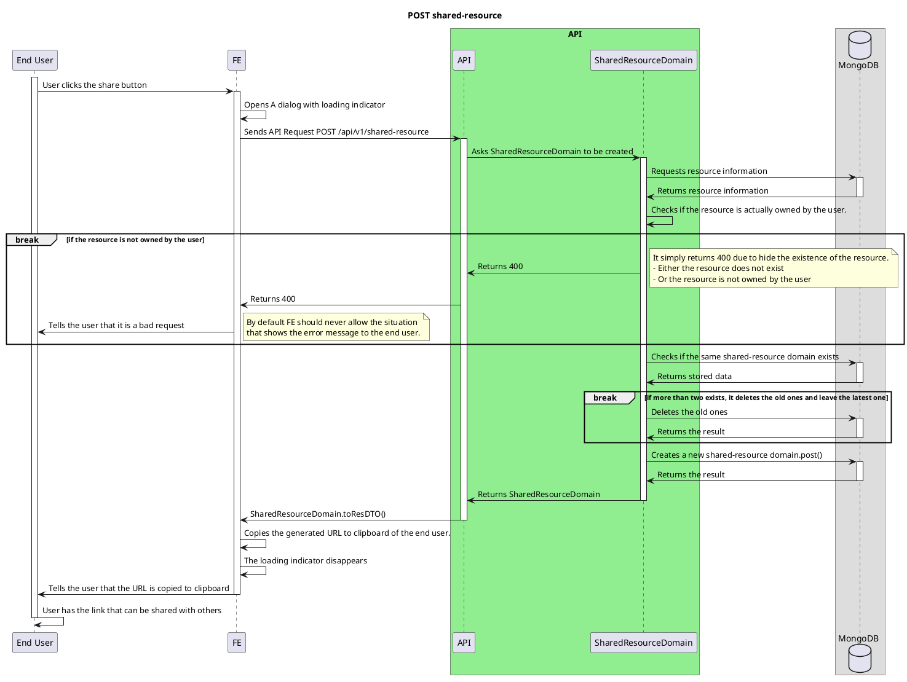
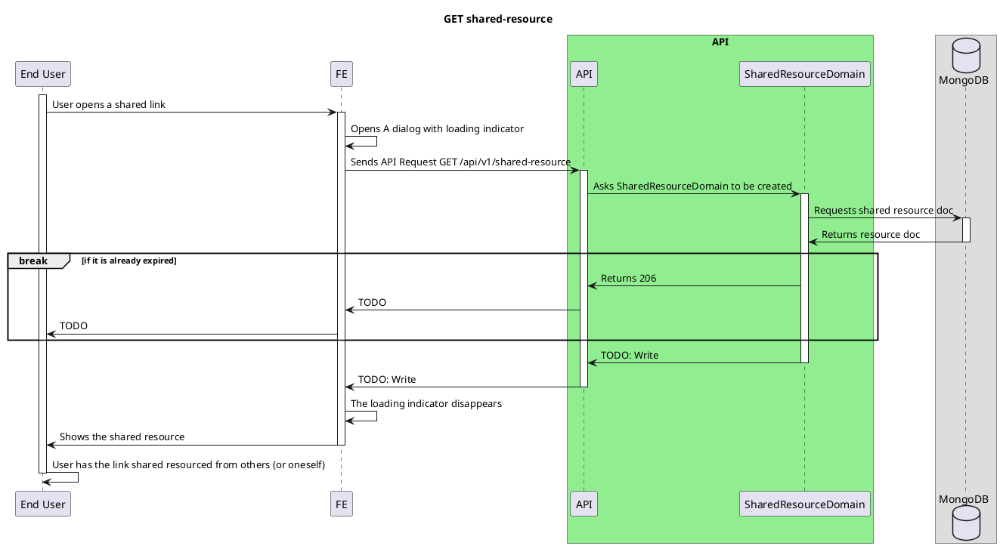

# Share Feature

<!-- TOC -->

- [Share Feature](#share-feature)
  - [Overview](#overview)
  - [POST shared-resource](#post-shared-resource)
  - [GET shared-resource](#get-shared-resource)

<!-- /TOC -->

## Overview

Share feature is basically share your word card with others by generating SharedResourceDomain.

## POST shared-resource

## GET shared-resource

