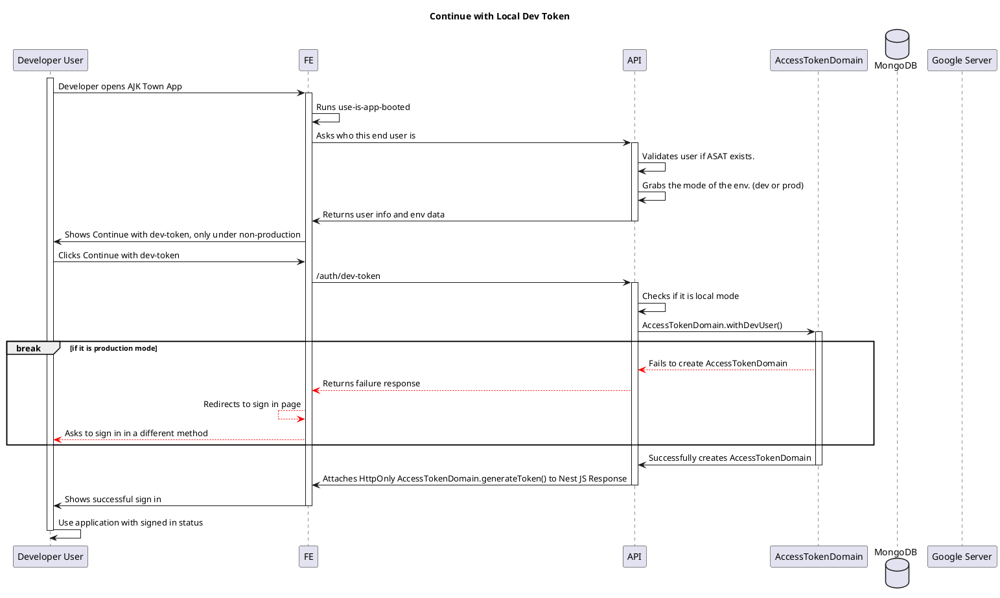

# Auth Flow

<!-- TOC -->

- [Auth Flow](#auth-flow)
  - [Get ASAT without 3rd party Oauth for developers](#get-asat-without-3rd-party-oauth-for-developers)
    - [ASAT](#asat)
  - [Authentication and Authorization for any API calls](#authentication-and-authorization-for-any-api-calls)

<!-- /TOC -->

## Get ASAT without 3rd party Oauth for developers

### ASAT

AJK Town Secured Access Token

## Authentication and Authorization for any API calls

