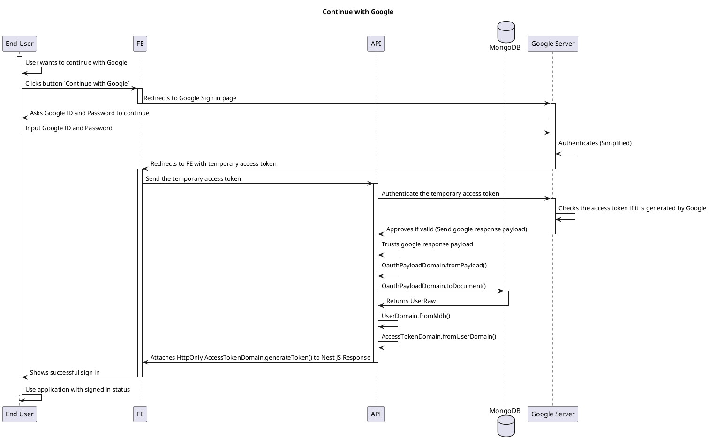

# Auth Flow

<!-- TOC -->

- [Auth Flow](#auth-flow)
  - [Continue with Google](#continue-with-google)
  - [Authentication and Authorization for any API calls](#authentication-and-authorization-for-any-api-calls)

<!-- /TOC -->

## Continue with Google

## Authentication and Authorization for any API calls

