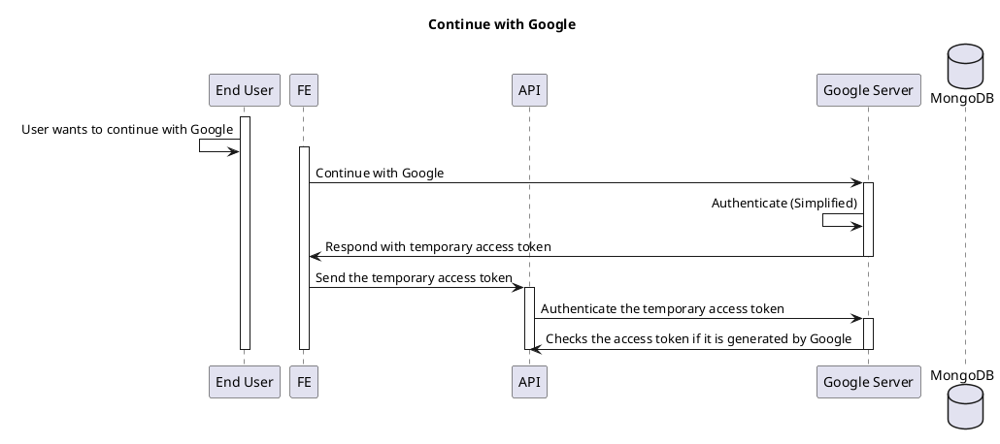

# Auth Flow

<!-- TOC -->

- [Auth Flow](#auth-flow)
  - [Sign in with Google](#sign-in-with-google)
  - [Authentication and Authorization for any API calls](#authentication-and-authorization-for-any-api-calls)

<!-- /TOC -->

## Sign in with Google

TODO: Not yet done with it.

## Authentication and Authorization for any API calls

