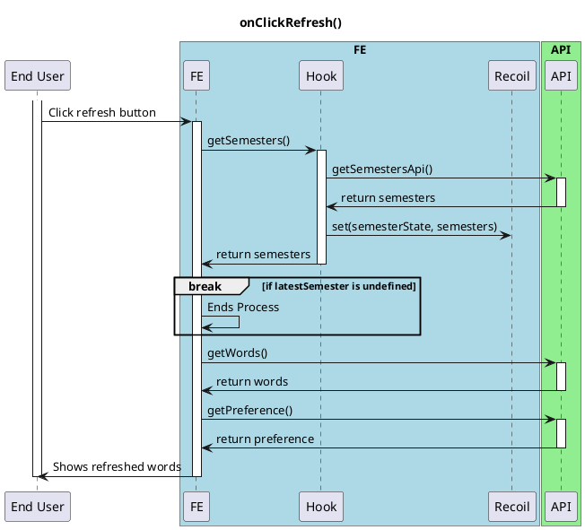
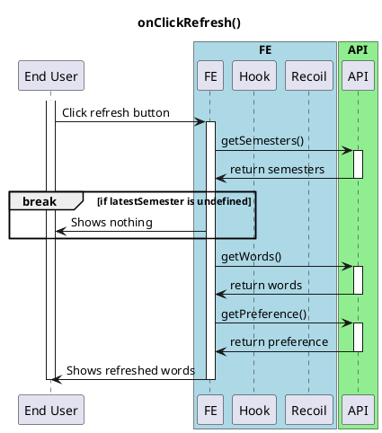
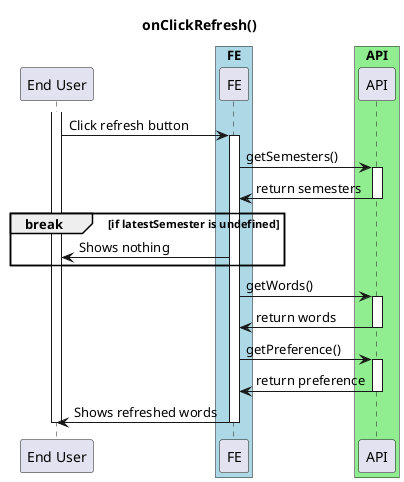

```plantuml

@startuml

title onClickRefresh()

participant "End User" as user

box "FE" #Lightblue
  participant "FE" as fe
  participant "Hook" as hook
  participant "Recoil" as recoil
box
box "API" #Lightgreen
  participant "API" as api
box


activate user
  user -> fe: Click refresh button
  activate fe
  fe -> hook: getSemesters()
    activate hook
      hook -> api: getSemestersApi()
      activate api
        hook <- api: return semesters
      deactivate api
      hook -> recoil: set(semesterState, semesters)
      fe <- hook: return semesters
    deactivate hook
  break if latestSemester is undefined
    fe -> fe: Ends Process
  end break
    fe -> api: getWords()
    activate api
      fe <- api: return words
    deactivate api
    fe -> api: getPreference()
    activate api
      fe <- api: return preference
    deactivate api
  user <- fe: Shows refreshed words
  deactivate fe
deactivate user
```

# Simple one

```plantuml

@startuml

title onClickRefresh()

participant "End User" as user

box "FE" #Lightblue
  participant "FE" as fe
  participant "Hook" as hook
  participant "Recoil" as recoil
box
box "API" #Lightgreen
  participant "API" as api
box

activate user
  user -> fe: Click refresh button
  activate fe
  fe -> api: getSemesters()
    activate api
      fe <- api: return semesters
    deactivate api
  break if latestSemester is undefined
    user <- fe: Shows nothing
  end break
    fe -> api: getWords()
    activate api
      fe <- api: return words
    deactivate api
    fe -> api: getPreference()
    activate api
      fe <- api: return preference
    deactivate api
  user <- fe: Shows refreshed words
  deactivate fe
deactivate user
```

# Simple one

```plantuml

@startuml

title onClickRefresh()

participant "End User" as user

box "FE" #Lightblue
  participant "FE" as fe
box
box "API" #Lightgreen
  participant "API" as api
box

activate user
  user -> fe: Click refresh button
  activate fe
  fe -> api: getSemesters()
    activate api
      fe <- api: return semesters
    deactivate api
  break if latestSemester is undefined
    user <- fe: Shows nothing
  end break
    fe -> api: getWords()
    activate api
      fe <- api: return words
    deactivate api
    fe -> api: getPreference()
    activate api
      fe <- api: return preference
    deactivate api
  user <- fe: Shows refreshed words
  deactivate fe
deactivate user
```
