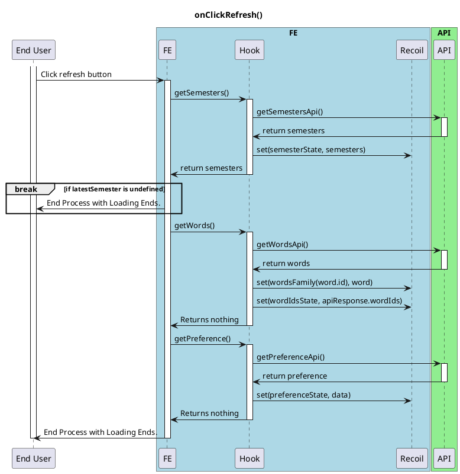
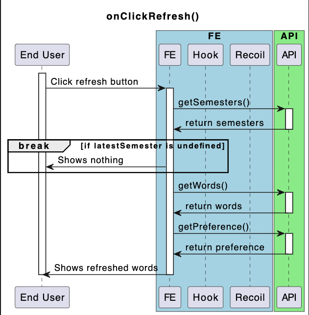
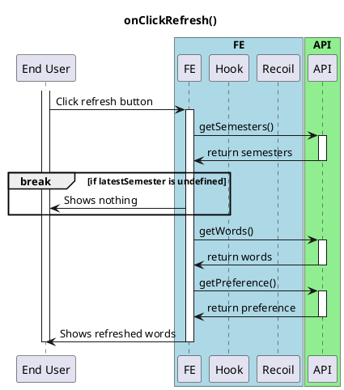
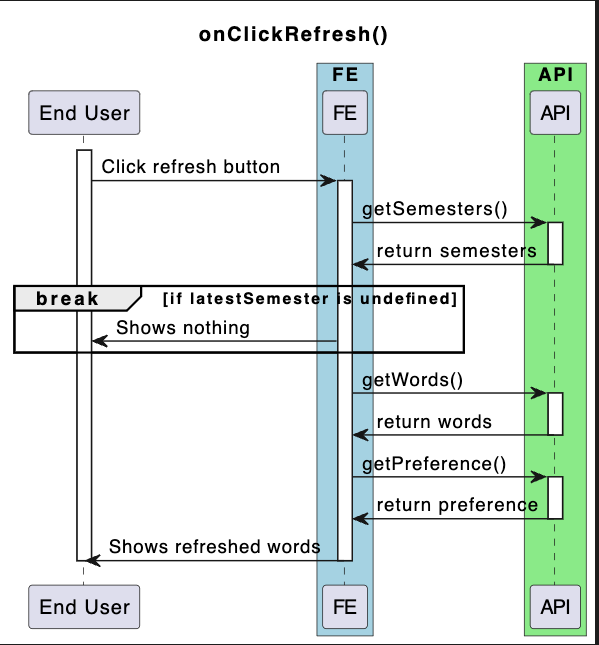
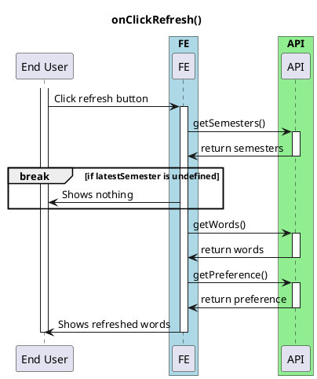

# Click Refresh Button

<!-- TOC -->

- [Click Refresh Button](#click-refresh-button)
  - [Overview](#overview)
    - [Most Detailed Ones](#most-detailed-ones)
    - [Second Most Detailed](#second-most-detailed)
    - [Simplest](#simplest)

<!-- /TOC -->

## Overview
This is a basic activity diagram for the onClickRefresh() function in the FE.

### Most Detailed Ones

plantuml code

### Second Most Detailed

plantuml code

### Simplest

plantuml code

