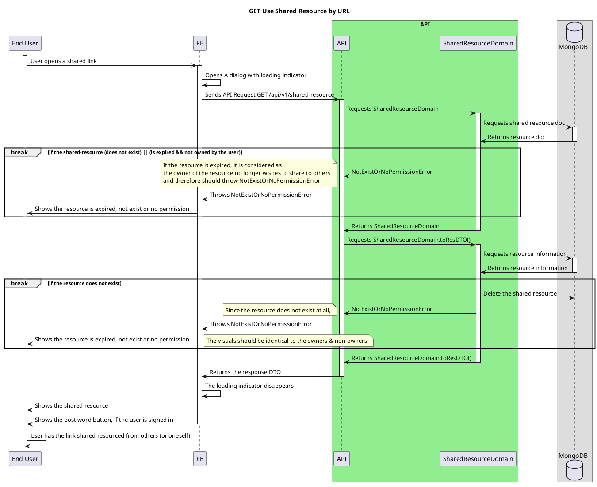

# Shared Resource By URL

<!-- TOC -->

- [Shared Resource By URL](#shared-resource-by-url)
  - [Overview](#overview)
  - [Shared Resource Link](#shared-resource-link)

<!-- /TOC -->

## Overview
Explains how shared resource link works with ajkapi server.

- The link contains the base64 encoded string of the resource id
  - And therefore the FE can use the ID directly.

- Post Shared resource details [here](./on-click-share-resource.md)

## Shared Resource Link
At present, the shared resource can be attainable by anyone including non-signed in users.

