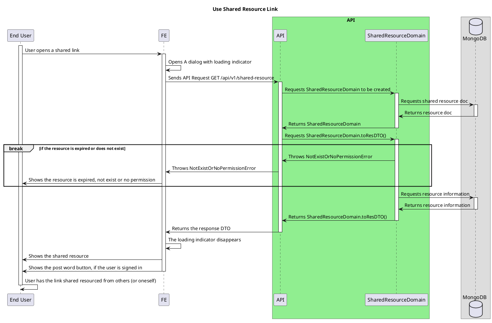

# Shared Resource Link

<!-- TOC -->

- [Shared Resource Link](#shared-resource-link)
  - [Overview](#overview)
  - [Shared Resource Link](#shared-resource-link-1)

<!-- /TOC -->

## Overview
Explains how shared resource link works with ajkapi server.

- Post Shared resource details [here](./on-click-share-resource.md)

## Shared Resource Link
At present, the shared resource can be attainable by anyone including non-signed in users.

