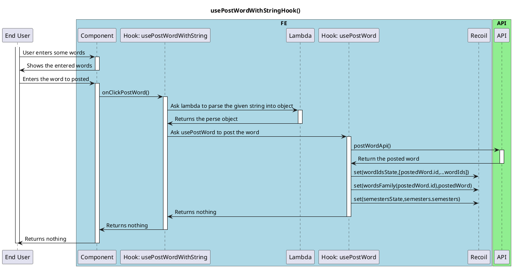

# On Post Word With String Hook

<!-- TOC -->

- [Use Post Word With String Hook](#use-post-word-with-string-hook)
  - [Overview](#overview)

<!-- /TOC -->

## Overview
This is a basic activity diagram for the usePostWordWithStingHook.

