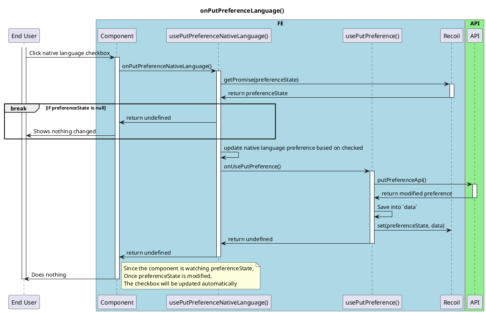

# On Put Preference Language

<!-- TOC -->

- [On Put Preference Language](#on-put-preference-language)
  - [Overview](#overview)

<!-- /TOC -->

## Overview
This is a basic activity diagram for the onPutPreferenceLanguage() function in the FE.

