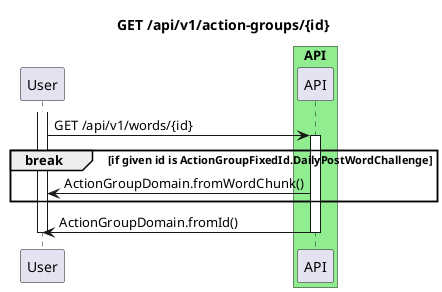

# Get Action Group By Id

<!-- TOC -->

- [Get Action Group By Id](#get-action-group-by-id)
  - [Overview](#overview)
  - [Diagram](#diagram)

<!-- /TOC -->

## Overview
Endpoint `GET /api/v1/action-groups/{id}` is used to get the details of an action group with the id.
ㅁ

## Diagram

