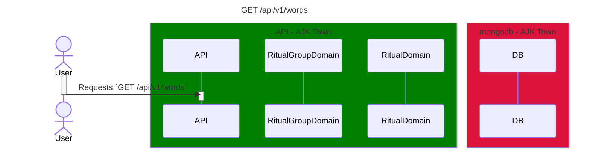

# Get Words API

<!-- TOC -->

- [Get Words API](#get-words-api)
  - [Overview](#overview)
  - [Diagram](#diagram)

<!-- /TOC -->

## Overview
Sequence diagram for `AJK Town API` endpoint: `GET /api/v1/words`

## Diagram

