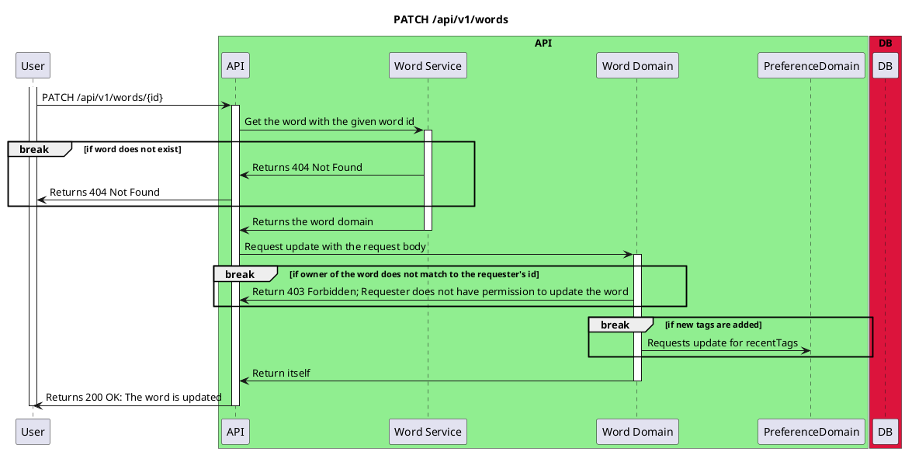

# Patch Word By Id

<!-- TOC -->

- [Patch Word By Id](#patch-word-by-id)
  - [Overview](#overview)
  - [Diagram](#diagram)

<!-- /TOC -->

## Overview
Endpoint `PATCH /api/v1/words/{id}` is used to update a word in the database. The user sends a request to the API with the word to be updated. The API then updates the word document in the database and returns the updated word document to the user.

## Diagram

