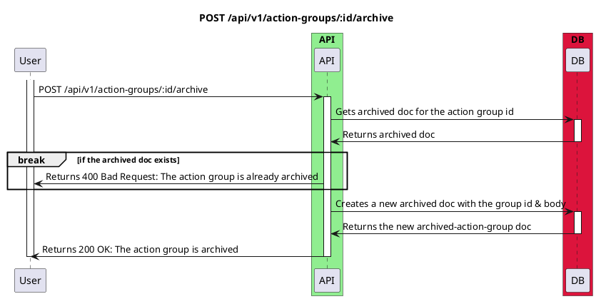

# Post Archived Action Group API

<!-- TOC -->

- [Post Archived Action Group API](#post-archived-action-group-api)
  - [Overview](#overview)
  - [PostArchivedActionGroupBodyDTO](#postarchivedactiongroupbodydto)
    - [actionGroupId: string](#actiongroupid-string)
    - [message: string](#message-string)
  - [Diagram](#diagram)

<!-- /TOC -->

## Overview

When user no longer needs an action group, they can archive it. This is a sequence diagram for archiving an action group using the AJK Town API.

## PostArchivedActionGroupBodyDTO

### actionGroupId: string
The id of the action group to be archived

### message: string
The reason why the user is archiving the action group

## Diagram

