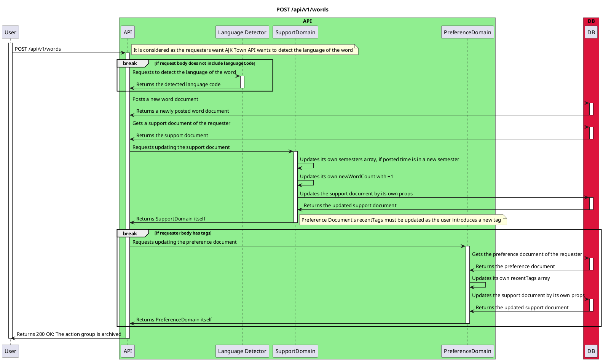

# Post Words

<!-- TOC -->

- [Post Words](#post-words)
  - [Overview](#overview)
  - [Diagram](#diagram)

<!-- /TOC -->

## Overview
Endpoint `POST /api/v1/words` is used to post a new word to the database. The user sends a request to the API with the word to be posted. The API then creates a new word document in the database and returns the created word document to the user.

## Diagram

