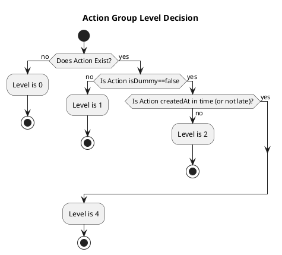

# Action Group

<!-- TOC -->

- [Action Group](#action-group)
  - [Overview](#overview)
  - [Derived State](#derived-state)
  - [Action Group State](#action-group-state)
  - [Action Group Level](#action-group-level)
  - [Sequence Diagram for Level Decision](#sequence-diagram-for-level-decision)

<!-- /TOC -->

## Overview

`Action Group` contains a list of Actions. The main goal is to inject an appropriate level for each action once it is returned to requesters.

## Derived State
For FEs to easily understand the current state before commitment, AJK Town API offers the following derived state:
- `isOnTimeCommittable`
- `isDummyCommittable`
- `isLateCommittable`
- `isDeletable`

These values are derived from the `Action Group State`. FEs should create an issue in API if they want to add more derived states. FEs should not use the `Action Group State` directly.

## Action Group State
`Action Group State` is the action group's current state for the current date (today). There is only one action group state per one action group.

- Early, OnTime, Late
- Committed, DummyCommitted, NotCommitted

For example, if it is committed on time, the state will be `OnTimeCommitted`

## Action Group Level

Action Group determines the level dynamically based on the following attributes:
- `Action`'s `createdAt`
- `Action`'s `isPerformed` (not yet implemented in April 2024)

## Sequence Diagram for Level Decision
This is a basic sequence diagram for how level is determined:

