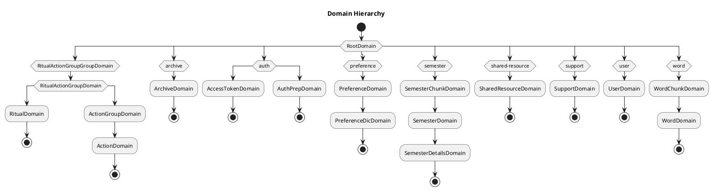

# Domain hierarchy

<!-- TOC -->

- [Domain hierarchy](#domain-hierarchy)
  - [Overview](#overview)
  - [Domain hierarchy](#domain-hierarchy-1)
  - [About Domain File Namings](#about-domain-file-namings)

<!-- /TOC -->

## Overview

Domains are not created equal. Some domains manage other domains. But the problem is that every domain is handled under the same directory `/src/domains`. This document's goal is to clarify the hierarchy of domains in the API server. After seeing the hierarchy, you can understand the relationship between domains and how they are managed. Also you will see the naming convention for each domain.

## Domain hierarchy

## About Domain File Namings

We use some suffixes to indicate the type of domain. The following is a list of suffixes and their meanings:
- `Chunk`: Domain with this suffix holds a list of other domains. For example, `WordChunkDomain` holds a list of `WordDomain`.
- `Group`: Domain with this suffix holds a list of other domains. For example, `RitualActionGroupDomain` holds a list of `RitualActionGroupGroupDomain`.

| Suffix  |                                                         Meaning                                                         | ExistsOnDb |
|:-------:|:-----------------------------------------------------------------------------------------------------------------------:|:----------:|
| `Chunk` |   Domain with this suffix holds a list of other domains. For example, `WordDomain` holds a list of `WordChunkDomain`.   |     No     |
| `Group` | Domain with this suffix holds a list of other domains. For example, `ActionGroupDomain` holds a list of `ActionDomain`. |    Yes     |