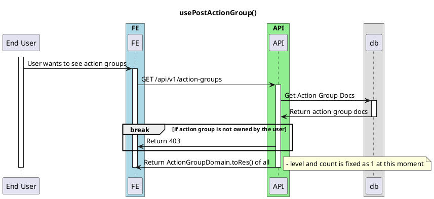

# On Get Action Groups

<!-- TOC -->

- [On Get Action Groups](#on-get-action-groups)
  - [Overview](#overview)

<!-- /TOC -->

TODO: Still Writing

## Overview

This is a basic diagram for onGetActionGroups, used when user wants to see the action groups. This is only for the owner's action group, which returns the action group details and the actions.

