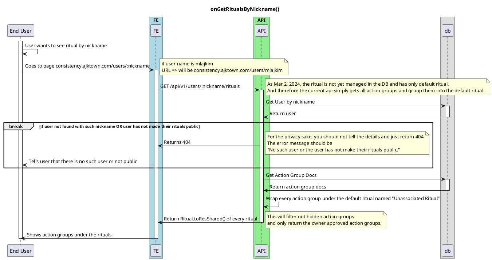

# On Get Rituals by Nickname

<!-- TOC -->

- [On Get Rituals by Nickname](#on-get-rituals-by-nickname)
  - [Overview](#overview)

<!-- /TOC -->

## Overview

Unlike `onGetRituals`, this sequence (`onGetRitualsByNickname`) includes public api that anyone can access to get rituals by nickname.

