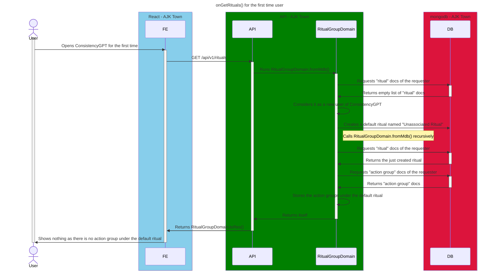

# On Get Rituals First Time

<!-- TOC -->

- [On Get Rituals First Time](#on-get-rituals-first-time)
  - [Overview](#overview)
  - [Diagram](#diagram)

<!-- /TOC -->

## Overview

Unlike [on-get-rituals](./on-get-rituals.md), the diagram specifically includes the situation where user is first time and default ritual has never been made yet.

## Diagram

