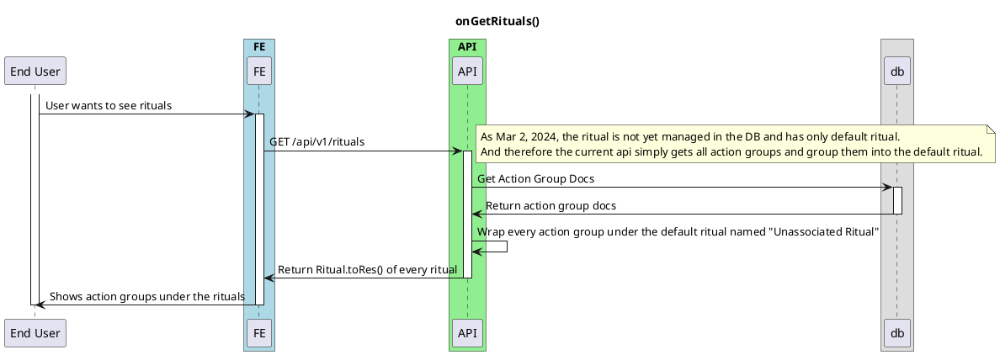

# On Get Action Groups

<!-- TOC -->

- [On Get Action Groups](#on-get-action-groups)
  - [Overview](#overview)

<!-- /TOC -->

## Overview

Ritual contains action groups and each action group manages its own actions.

