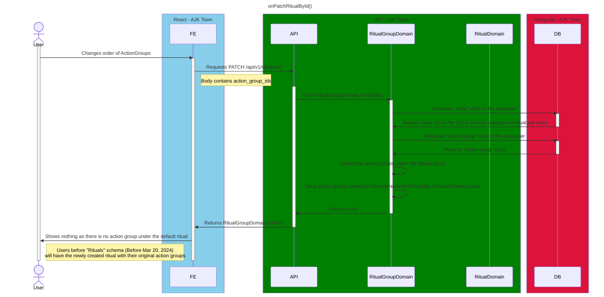

# On Get Rituals

<!-- TOC -->

- [On Get Rituals](#on-get-rituals)
  - [Overview](#overview)
  - [Diagram](#diagram)

<!-- /TOC -->

## Overview

Ritual contains action groups and each action group manages its own actions.

RitualGroupDomain will smartly create a new default ritual if the user does not have any rituals yet.

## Diagram
