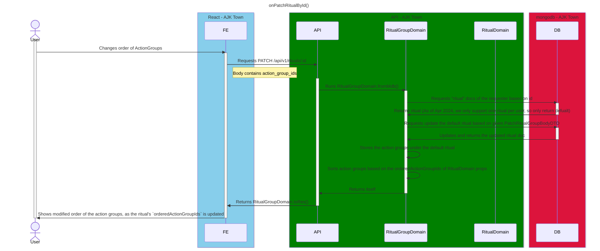

# On Patch Ritual By Id

<!-- TOC -->

- [On Patch Ritual By Id](#on-patch-ritual-by-id)
  - [Overview](#overview)
  - [Modifiable Attributes](#modifiable-attributes)
  - [Diagram](#diagram)

<!-- /TOC -->

## Overview
Sequence diagram for patching properties of the ritual by its id.

However, the id is currently fixed as `default` as of Apr 2024.

This is due to the fact that we only support one ritual per user.

`"PATCH  /api/v1/rituals/default"` only.

## Modifiable Attributes

As of Apr 2024, the only modifiable attribute is `orderedActionGroupIds`.

## Diagram

