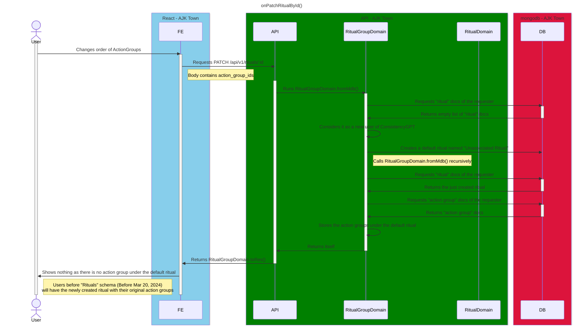

# On Patch Ritual By Id

<!-- TOC -->

- [On Patch Ritual By Id](#on-patch-ritual-by-id)
  - [Overview](#overview)
  - [Diagram](#diagram)

<!-- /TOC -->

## Overview
Sequence diagram for patching properties of the ritual by its id.

## Diagram

