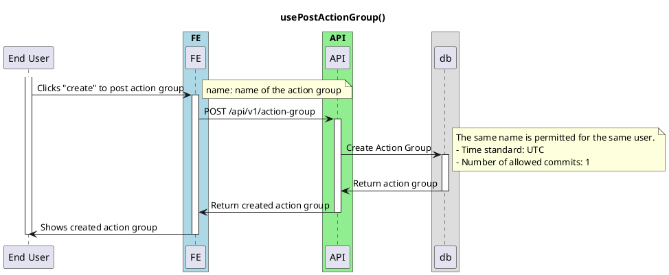

# On Post Action Group

<!-- TOC -->

- [On Post Action Group](#on-post-action-group)
  - [Overview](#overview)

<!-- /TOC -->

TODO: Still Writing

## Overview
This is a basic diagram for onPostActionGroup. This is used when user wants to post a new action group for their newly goal of consistency.

