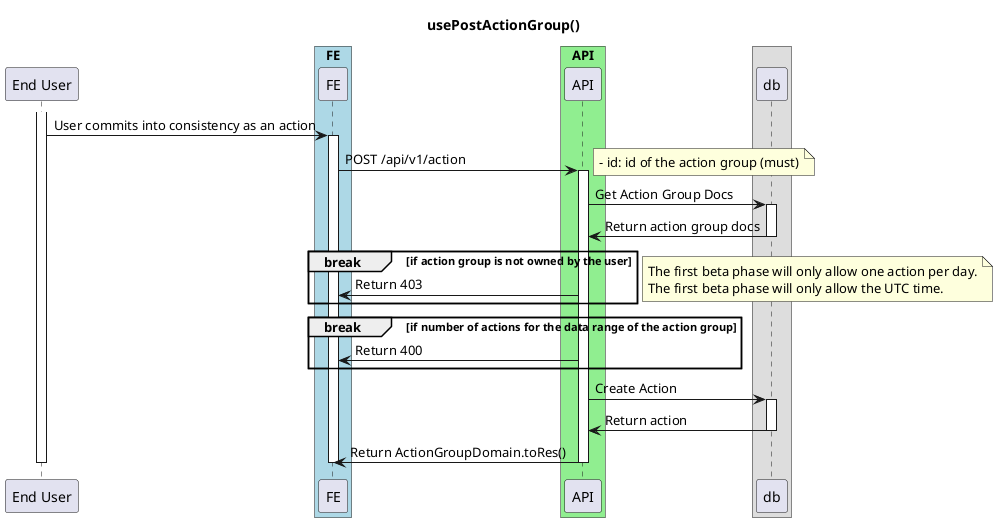

# On Post Action

<!-- TOC -->

- [On Post Action](#on-post-action)
  - [Overview](#overview)

<!-- /TOC -->

TODO: Still Writing

## Overview
This is a basic diagram for onPostAction, used when user has contributed.

