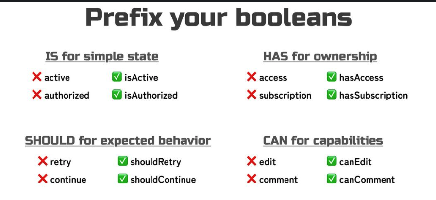

# Boolean Naming

<!-- TOC -->

- [Boolean Naming](#boolean-naming)
  - [Overview](#overview)
  - [Simple rule today:](#simple-rule-today)

<!-- /TOC -->

## Overview
This documentation explains the general rule of writing boolean variables in AJK Town projects.

## Simple rule today:
AJK Town follows the following rule. Not 100% strictly but recommended:
