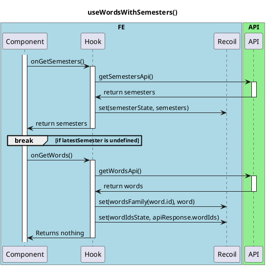
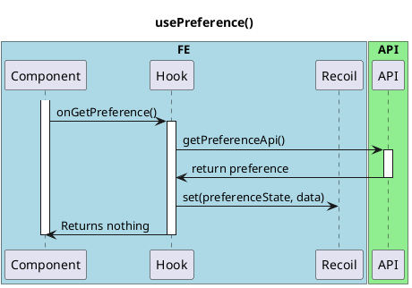

# On Click Refresh Button

<!-- TOC -->

- [On Click Refresh Button](#on-click-refresh-button)
  - [Overview](#overview)
    - [useWordsWithSemesters.hook](#usewordswithsemestershook)
    - [usePreference.hook](#usepreferencehook)

<!-- /TOC -->

## Overview
This is a basic sequence diagram for the onClickRefresh() function in the FE.

In the onClickRefresh() function, the following hooks are processed simultaneously.
　
 - use-words-with-semesters.hook

 - use-preference.hook

### useWordsWithSemesters.hook

### usePreference.hook

