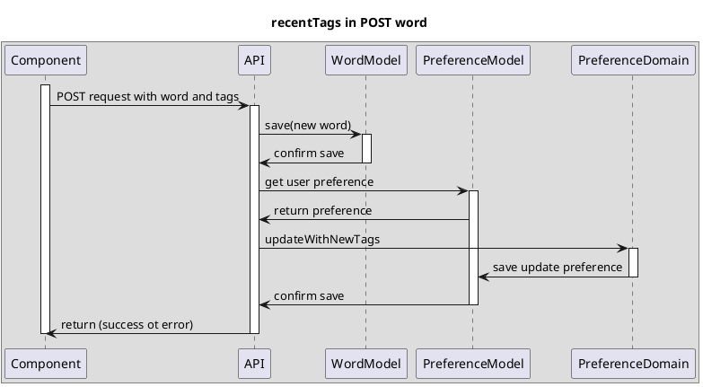
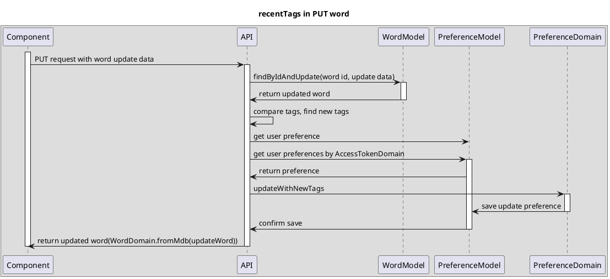

# Update preference's recentTags

<!-- TOC -->

- [Update preference's recentTags](#update-preferences-recenttags)
  - [Overview](#overview)
    - [recentTags in POST word](#recenttags-in-post-word)
    - [recentTags in PUT word](#recenttags-in-put-word)

<!-- /TOC -->

## Overview
This is a basic sequence diagram for that API update preference's recentTags.

API wants to store user's recent tags when the following happens:

 - new tags are posted for newly-created words (in POST word)

 - new tags are posted for already-created words　(in PUT word)

### recentTags in POST word

### recentTags in PUT word

