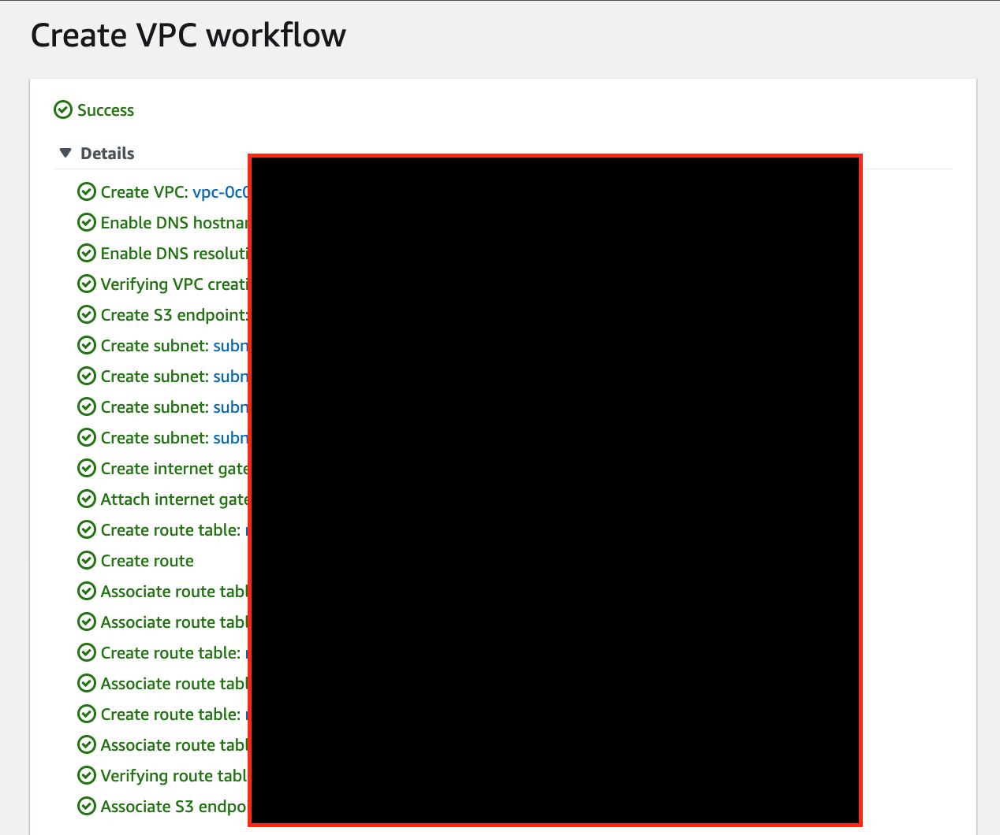
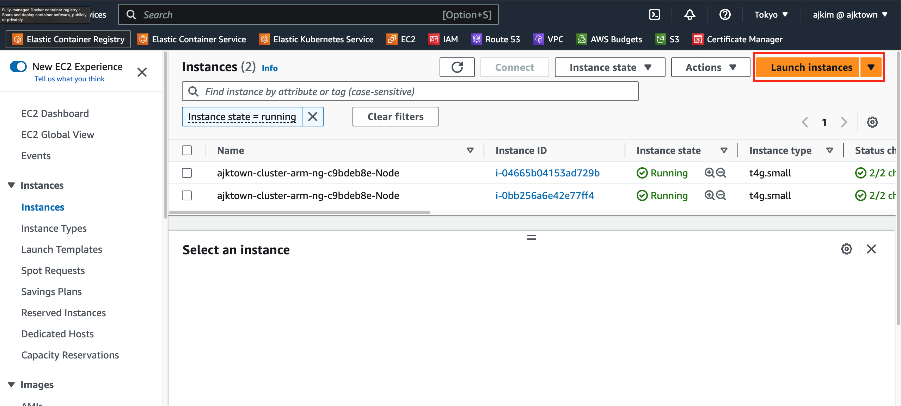

# EC2 and K3s

<!-- TOC -->

- [EC2 and K3s](#ec2-and-k3s)
  - [Overview](#overview)
  - [Create VPC](#create-vpc)
  - [Correctly configure AWS EC2 Instance](#correctly-configure-aws-ec2-instance)
    - [Advanced Details User Data](#advanced-details-user-data)
  - [Finally create EC2 instance](#finally-create-ec2-instance)

<!-- /TOC -->

## Overview

Create VPC and EC2 instance to run the k3s


## Create VPC

The VPC UI these days is super convenient.



| Key  |       Your Input        |
|:----:|:-----------------------:|
| Name | ajktown-k3s-cluster-vpc |


## Correctly configure AWS EC2 Instance




|            Key             |                        Your Input                         |
|:--------------------------:|:---------------------------------------------------------:|
|            Name            |                    ajktown-k3s-cluster                    |
|            AMI             |         Amazon Linux 2 AMI (HVM), SSD Volume Type         |
|        Architecture        |                       64-bit (Arm)                        |
|       Instance Type        |                         t4g.small                         |
|           Subnet           |                        any public                         |
|   Auto-assign public IP    |                          Enable                           |
|          Key pair          |                 ajktown-k3s-cluster [^2]                  |
|            VPC             |                  ajktown-k3s-cluster-vpc                  |
|   Auto Assign Public IP    |                          Enable                           |
|       Security Group       |                ajktown-k3s-cluster-sg [^2]                |
|        Description         |     Essential security group for ajktown-k3s-cluster      |
|     HTTPs Inbound Rule     |                          443/tcp                          |
|            EBS             |                       30Gb[^3] gp3                        |
| Advanced Details.User data | [Advanced Details User Data](#advanced-details-user-data) |


### Advanced Details User Data
```sh

#!/bin/bash

# Install Docker
sudo yum update
sudo yum search docker
sudo yum info docker
sudo yum install docker

sudo usermod -a -G docker ec2-user
id ec2-user
newgrp docker

sudo systemctl enable docker.service
sudo systemctl start docker.service
sudo systemctl status docker.service

# Install kubectl
curl -LO "https://dl.k8s.io/release/$(curl -L -s https://dl.k8s.io/release/stable.txt)/bin/linux/arm64/kubectl"
chmod +x ./kubectl
mkdir -p $HOME/bin && cp ./kubectl $HOME/bin/kubectl && export PATH=$HOME/bin:$PATH
echo 'export PATH=$HOME/bin:$PATH' >> ~/.bashrc

# Install k9s
curl -sS https://webinstall.dev/k9s | bash
source ~/.config/envman/PATH.env

```


## Finally create EC2 instance


<!-- Footnote -->


[^2]: Recommend to create its own for the instance

[^3]: Free up to 30Gb


<!-- Footnote -->