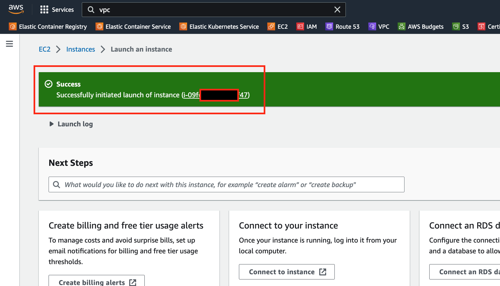

# EC2 and K3s

<!-- TOC -->

- [EC2 and K3s](#ec2-and-k3s)
  - [Overview](#overview)
  - [Create VPC](#create-vpc)
  - [Create EC2 Instance](#create-ec2-instance)
  - [Finally create EC2 instance](#finally-create-ec2-instance)

<!-- /TOC -->

## Overview

Create VPC and EC2 instance to run the k3s

## Create VPC

The VPC UI these days is super convenient.

| Key  |       Your Input        |
|:----:|:-----------------------:|
| Name | ajktown-k3s-cluster-vpc |

## Create EC2 Instance

|          Key          |                    Your Input                    |
|:---------------------:|:------------------------------------------------:|
|         Name          |               ajktown-k3s-cluster                |
|          AMI          |    Amazon Linux 2 AMI (HVM), SSD Volume Type     |
|     Architecture      |                   64-bit (Arm)                   |
|     Instance Type     |                    t4g.small                     |
|        Subnet         |                    any public                    |
| Auto-assign public IP |                      Enable                      |
|       Key pair        |             ajktown-k3s-cluster [^2]             |
|          VPC          |             ajktown-k3s-cluster-vpc              |
| Auto Assign Public IP |                      Enable                      |
|    Security Group     |           ajktown-k3s-cluster-sg [^2]            |
|      Description      | Essential security group for ajktown-k3s-cluster |
|  HTTPs Inbound Rule   |                     443/tcp                      |
|          EBS          |                   30Gb[^3] gp3                   |

## Finally create EC2 instance

<!-- Footnote -->

[^2]: Recommend to create its own for the instance

[^3]: Free up to 30Gb

<!-- Footnote -->