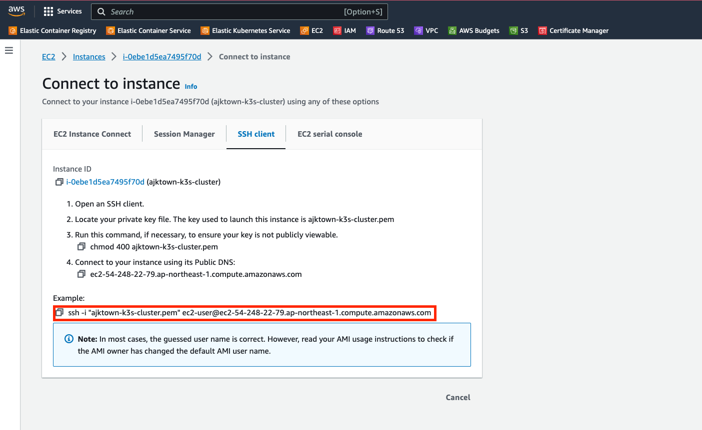

# EC2 and k3s

<!-- TOC -->

- [EC2 and k3s](#ec2-and-k3s)
  - [Overview](#overview)
  - [Set an alias](#set-an-alias)
  - [Connect with the alias above](#connect-with-the-alias-above)

<!-- /TOC -->

## Overview

Connect to the EC2 with EIP attached

## Set an alias
Set an alias for connecting to the cluster


```sh
vi ~/.bashrc

ajktown_connect_command="ssh -i "your-key-name" ec2-user@ec2-ip-address-here.ap-northeast-1.compute.amazonaws.com"
alias ajktown="cd /to/where/your/k3s-ec2-ajktown.pem/is && $ajktown_connect_command"
```

## Connect with the alias above

```sh
ajktown
```
