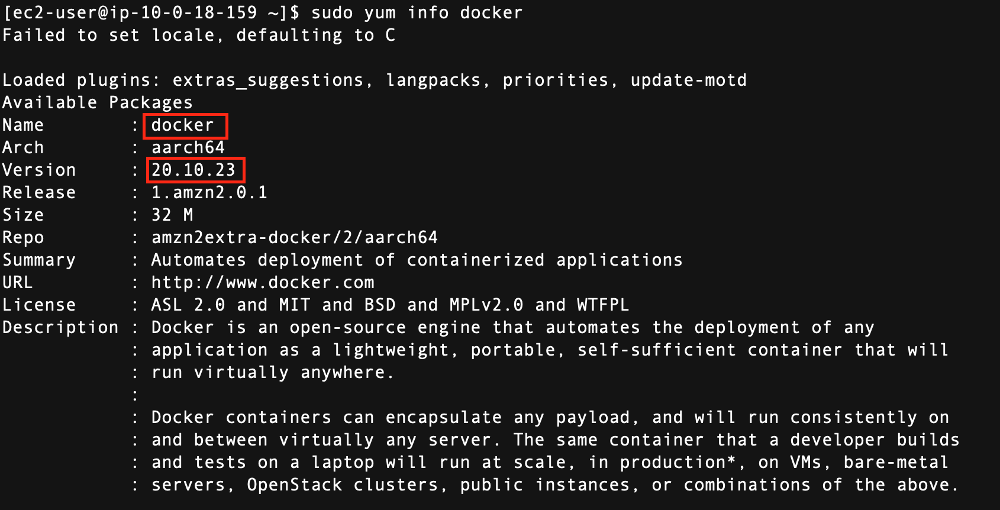
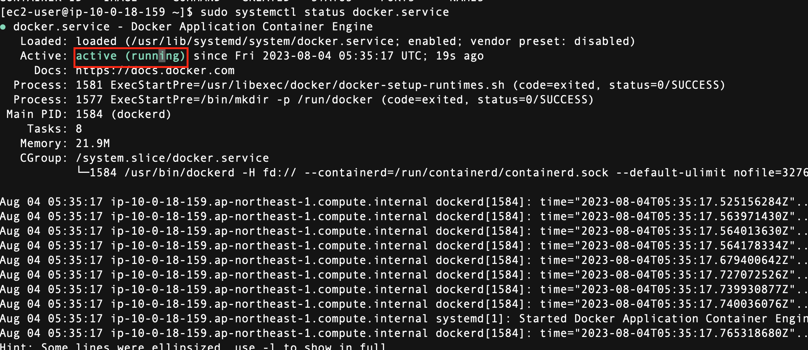

# Install Docker

<!-- TOC -->

- [Install Docker](#install-docker)
  - [Overview](#overview)
  - [Find which version of Docker to be installed](#find-which-version-of-docker-to-be-installed)
  - [Install docker](#install-docker)
  - [Optional](#optional)
  - [Enable docker service at AMI boot time & start](#enable-docker-service-at-ami-boot-time--start)
  - [Reference](#reference)

<!-- /TOC -->

## Overview

Install docker on the EC2 Instance

## Find which version of Docker to be installed

```sh

sudo yum update
sudo yum search docker
sudo yum info docker

```




## Install docker

```sh

sudo yum install docker -y

```


## Optional

Add group membership for the default ec2-user so you can run all docker commands without using the sudo command

```sh

sudo usermod -a -G docker ec2-user
id ec2-user
newgrp docker

```

## Enable docker service at AMI boot time & start
```sh

sudo systemctl enable docker.service
sudo systemctl start docker.service
sudo systemctl status docker.service
docker ps

```




## Reference

- https://www.cyberciti.biz/faq/how-to-install-docker-on-amazon-linux-2/