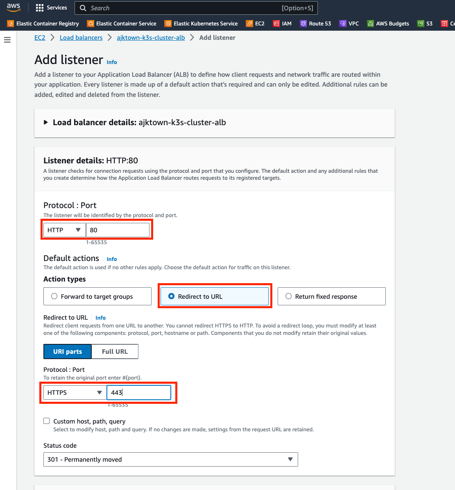
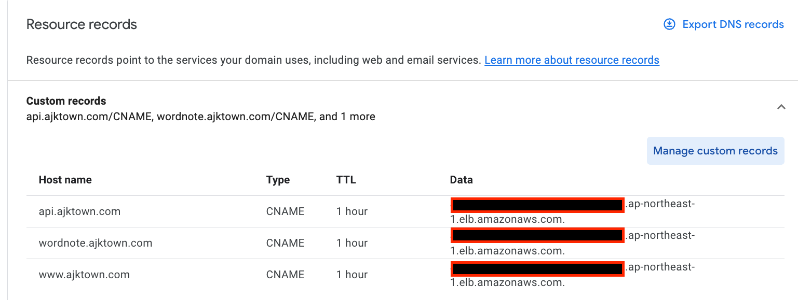

# Create ALB and Target Group

<!-- TOC -->

- [Create ALB and Target Group](#create-alb-and-target-group)
  - [Overview](#overview)
  - [Create target group](#create-target-group)
    - [Specify group details](#specify-group-details)
    - [Register Target](#register-target)
  - [Create Application Load Balancer](#create-application-load-balancer)
    - [network mapping](#network-mapping)
    - [Listening and routings](#listening-and-routings)
    - [Secure Listener Settings](#secure-listener-settings)
    - [Click create](#click-create)
    - [Modify ALB with redirect](#modify-alb-with-redirect)
    - [Register the ALB DNS into your Domain DNS service](#register-the-alb-dns-into-your-domain-dns-service)

<!-- /TOC -->

## Overview

Create ALB and Target Group to route the traffic to the k3s cluster.

## Create target group

### Specify group details

|       Name        |          Value          |
|:-----------------:|:-----------------------:|
| target group name | ajktown-k3s-cluster-tg  |
|     protocol      |          http           |
|       port        |           80            |
|        vpc        | ajktown-k3s-cluster-vpc |
| protocol version  |          http1          |

### Register Target
Select the instance you just created.
| Name | Value |
|:----:|:-----:|
| Port |  80   |

## Create Application Load Balancer

|      Name      |          Value          |
|:--------------:|:-----------------------:|
|      name      | ajktown-k3s-cluster-alb |
|    protocol    |          http           |
| Security Group | ajktown-k3s-cluster-sg  |

### network mapping

Make sure it is mapped to the `public` subnets, not private subnets.

### Listening and routings

|   Name    | Value |
|:---------:|:-----:|
| Protocols | https |
|   Port    |  443  |

### Secure Listener Settings

|      Name       |                         Value                          |
|:---------------:|:------------------------------------------------------:|
| Security policy | ESBSecurityPolicy-TLS13-1-2-2021-06 (recommended) [^1] |
|    From ACM     |                   *.ajktown.com [^2]                   |

[^1]: If AWS recommends different one, use that instead.

[^2]: Requires your certificate stored in ACM. If you don't have one, create one.

### Click create

Create the alb.

### Modify ALB with redirect

### Register the ALB DNS into your Domain DNS service

