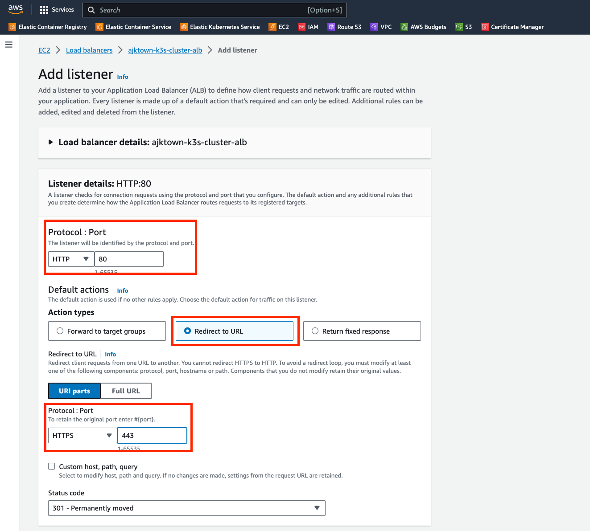

# Create ALB and Target Group

Name: ajktown-k3s-cluster-tg
HTTPS 443 first[^1]
VPC: ajktown-k3s-cluster-vpc
HTTP2
Health check: HTTP
Healtcheck path: /

[^1]: In the later step of this document, you will implement HTTP to HTTPS redirect

## HTTP to HTTPS redirect setting

## Create ALB

ajktown-k3s-cluster-alb
vpc: ajktown-k3s-cluster-vpc
Mapping: all subnets

Listner:
HTTPS 443 ajktown-k3s-cluster-tg

ACM: 

## Map Redirect

