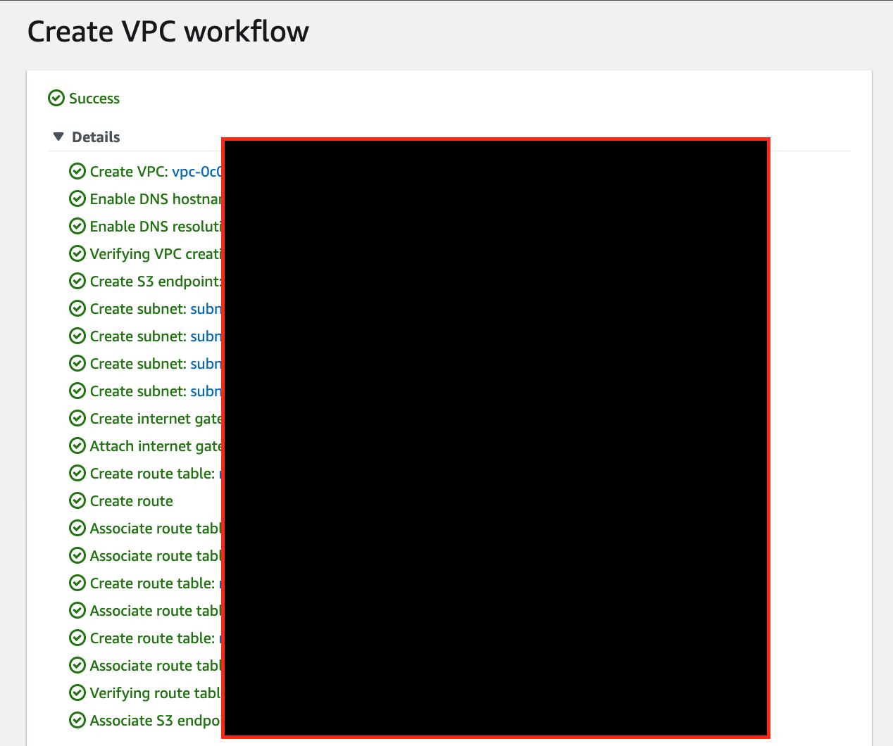
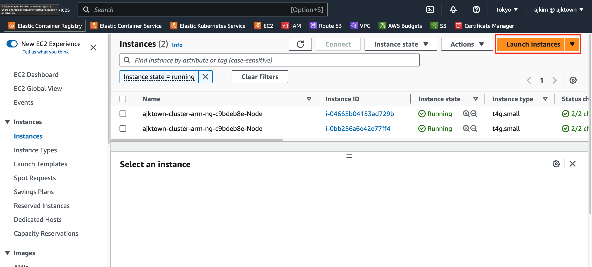
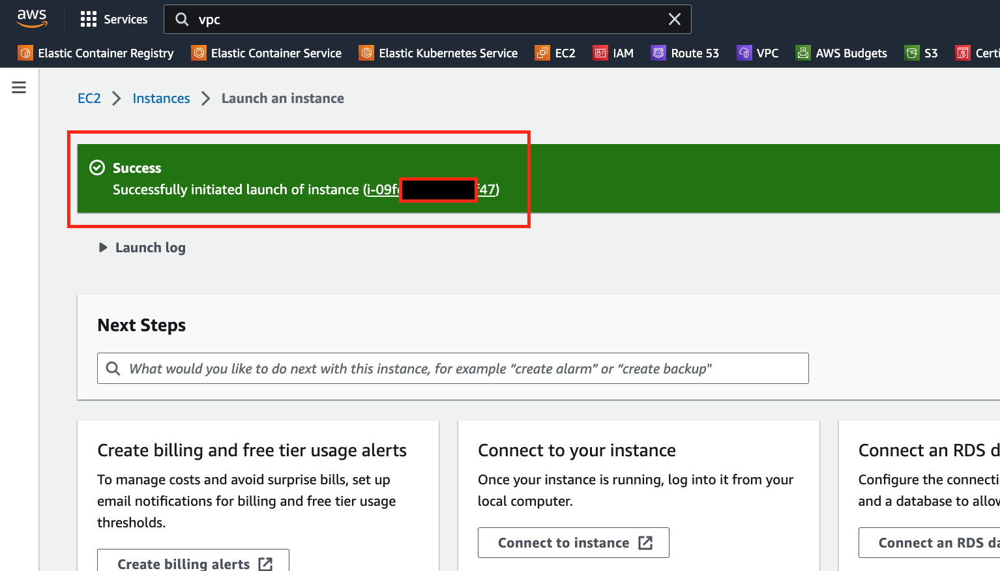

# EC2 and Minikube

<!-- TOC -->

- [EC2 and Minikube](#ec2-and-minikube)
  - [Overview](#overview)
  - [Create VPC](#create-vpc)
  - [Create AWS EC2 Instance on the VPC](#create-aws-ec2-instance-on-the-vpc)

<!-- /TOC -->

## Overview

Create VPC and EC2 instance to run the minikube

## Create VPC

The VPC UI these days is super convinient.

## Create AWS EC2 Instance on the VPC

|          Key          |                Your Input                 |
|:---------------------:|:-----------------------------------------:|
|         Name          |           ajktown-minikube-ec2            |
|          AMI          | Amazon Linux 2 AMI (HVM), SSD Volume Type |
|     Architecture      |               64-bit (Arm)                |
|     Instance Type     |                 t4g.small                 |
|       Key pair        |         ajktown-minikube-ec2 [^1]         |
|          VPC          |           ajktown-minikube-vpc            |
| Auto Assign Public IP |                  Enable                   |
|    Security Group     |       ajktown-minikube-ec2-sg [^1]        |
|          EBS          |                 30Gb[^2]                  |

[^1]: Recommend to create its own for the instance

[^2]: Free up to 30Gb

