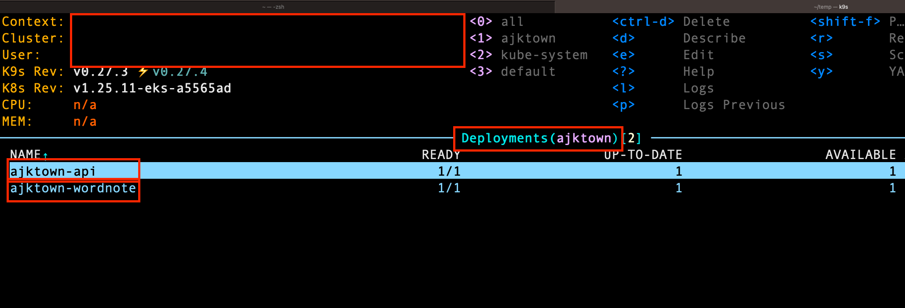

# Kubectl Apply

<!-- TOC -->

- [Kubectl Apply](#kubectl-apply)
  - [Overview](#overview)
  - [How to apply k8s resources](#how-to-apply-k8s-resources)
  - [How to check](#how-to-check)

<!-- /TOC -->

## Overview
TODO: Write

## How to apply k8s resources

Apply your k8s resources stored on k8s of the following

- https://github.com/ajktown/wordnote/tree/main/k8s
- https://github.com/ajktown/api/tree/main/k8s

by
```sh
# This will apply all k8s yaml files in the directory
kubectl apply -f ./k8s
```


## How to check

We can see that `api` and `wordnote` is successfully deployed on `ajktown` namespace.

