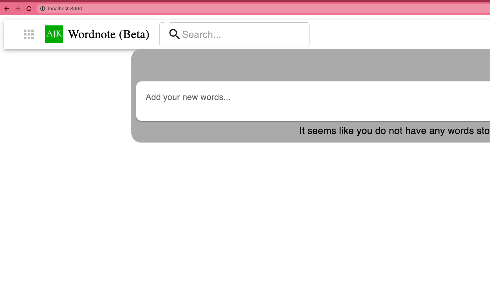

# Final Operation Check

<!-- TOC -->

- [Final Operation Check](#final-operation-check)
  - [Overview](#overview)
  - [Purpose](#purpose)
    - [Open browser](#open-browser)

<!-- /TOC -->

## Overview
You will check if ajktown applications are running on your local machine.

## Purpose
Although every step might be possibly wrong as the time passes, it gives a general idea of how to set up the environment.

### Open browser

Try to create a word or something and see if data is successfully stored in the database.