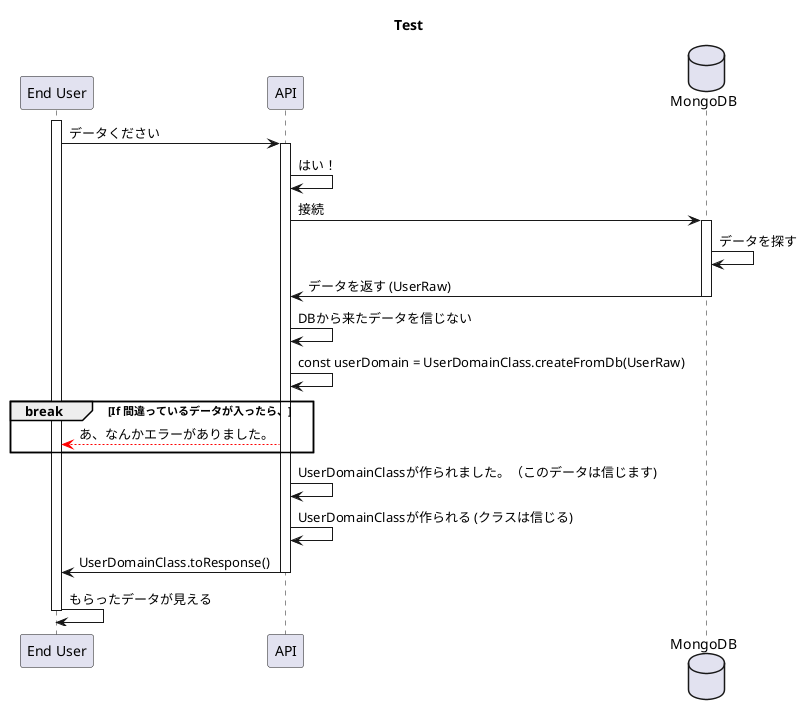

# Auth Flow

<!-- TOC -->

- [Auth Flow](#auth-flow)
  - [TODOs](#todos)
  - [Sign in with Google](#sign-in-with-google)

<!-- /TOC -->

## TODOs
1. Delete this file if Akane understands Domain

## Sign in with Google

