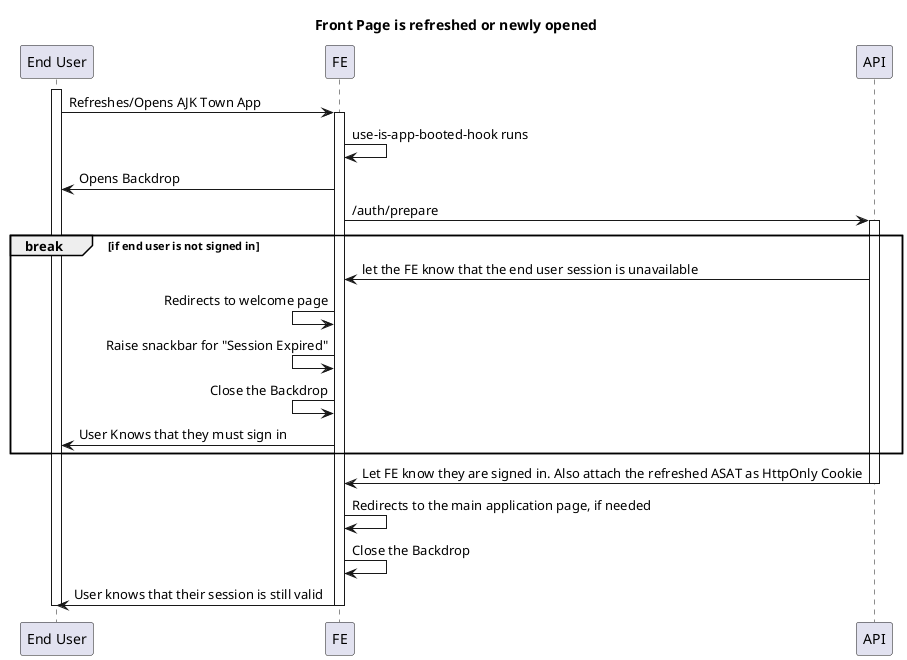
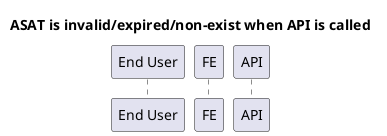

# Sign out on FE

TODO: This entire file is under writing.

<!-- TOC -->

- [Sign out on FE](#sign-out-on-fe)
  - [Overview](#overview)
  - [End user knows their session has been killed when](#end-user-knows-their-session-has-been-killed-when)
  - [What FE does](#what-fe-does)
  - [auth/prepare](#authprepare)
  - [Situations](#situations)
    - [Front Page is refreshed or newly opened](#front-page-is-refreshed-or-newly-opened)
    - [ASAT is invalid/expired/non-exist when API is called](#asat-is-invalidexpirednon-exist-when-api-is-called)
      - [TODO: Implement](#todo-implement)

<!-- /TOC -->


## Overview

Sign out can be automatically run by the end user

- When User clicks `Sign out` button
- When ASAT Token is expired
- When ASAT Token is not validated by the API Server

## End user knows their session has been killed when

- When API call is made (The API server )

## What FE does

- Reset the entire state into the default
- Redirects FE to the `Welcome page`
  - Let end user also know why they were removed
    - Successfully signed out
    - Your session has been expired (Maybe even if it is corrupted)

## auth/prepare

AuthPrepare controller of AJK Town is an endpoint that returns the valuable information for the following types of users
- Frontend Page
- Other 3rd party API

Every user of the API server must depend on the returned data, instead of defining their own from their server/frontend page.

```json
{
  "isSignedIn": true,
  "environment": "production" // "local", "production" only
}
```

## Situations

### Front Page is refreshed or newly opened




### ASAT is invalid/expired/non-exist when API is called


#### TODO: Implement




