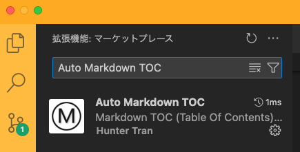

# Install Auto Markdown TOC

<!-- TOC -->

- [Install Auto Markdown TOC](#install-auto-markdown-toc)
  - [Prerequisites](#prerequisites)
    - [Sample Plantuml Code](#sample-plantuml-code)
  - [Basic installs](#basic-installs)
    - [Install Auto Markdown TOC extension if not installed](#install-auto-markdown-toc-extension-if-not-installed)

<!-- /TOC -->
## Prerequisites
- What is Plantuml?
  - `Auto Markdown TOC` refers to an automatically generated table of contents in Markdown, a lightweight markup language often used for formatting plain text.  
  In Markdown, a TOC is a list of links pointing to headings within a document, providing a quick way for readers to navigate through the content. (Detailed information [here](https://marketplace.visualstudio.com/items?itemName=huntertran.auto-markdown-toc))
  - You can generate an automatic table of contents for your Markdown document.
  
### Sample Plantuml Code
You can do `command + shift + v` to see the preview of the document.

## Basic installs
Basic installs contain the shared install for both local and remote(???)

### Install Auto Markdown TOC extension if not installed

