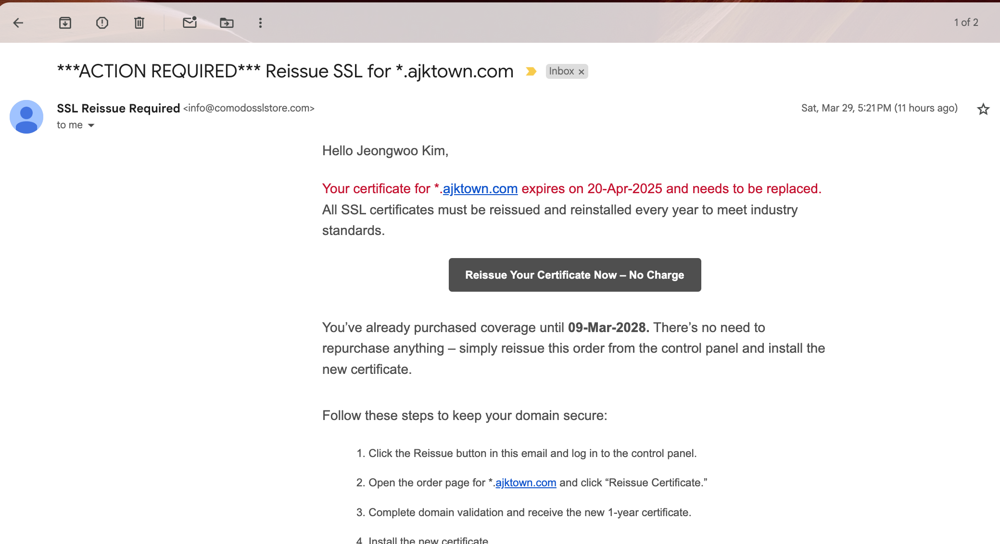

# How to install AJKTown CA

<!-- TOC -->

- [How to install AJKTown CA](#how-to-install-ajktown-ca)
  - [Overview](#overview)
  - [Procedure](#procedure)
    - [Login in to COMODO SSL Store](#login-in-to-comodo-ssl-store)
    - [Go to dashboard of orders](#go-to-dashboard-of-orders)
    - [Click your CA and Reissue now](#click-your-ca-and-reissue-now)
    - [Create/Find your CSR](#createfind-your-csr)
    - [Enter your CSR](#enter-your-csr)
    - [Choose Domain Verification Method](#choose-domain-verification-method)
    - [Use admin@ajktown.com for verification](#use-adminajktowncom-for-verification)
    - [Wait for Certificate to be issued](#wait-for-certificate-to-be-issued)

<!-- /TOC -->

## Overview
Every March, AJK Town receives an `ACTION REQUIRED` email from Comodo, as the following:

*The image above is good to be public as it does not contain any sensitive information.*


## Procedure

### Login in to COMODO SSL Store


### Go to dashboard of orders
https://certpanel.com/comodo/dashboard/orders


### Click your CA and Reissue now
Click reissue now:


### Create/Find your CSR
You must be aware of:
- Where your private key is stored
- Where your CSR created based on the private key above

You can use the following command to see the contents of CSR:
```bash
openssl req -in ajktown.csr -noout -text
```

And do the following to copy the CSR:
```
cat ajktown.csr
```

### Enter your CSR


### Choose Domain Verification Method
Simply use email if you are the owner `ajkim@ajktown.com` of the email written in the CN of CSR


### Use admin@ajktown.com for verification


### Wait for Certificate to be issued
