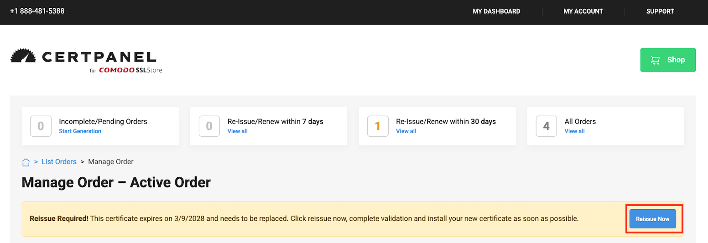
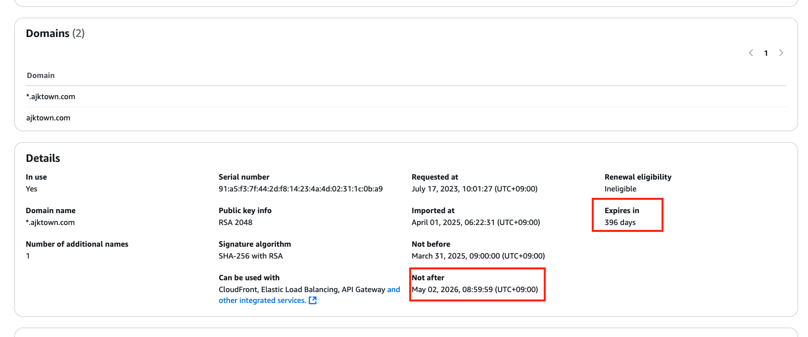

# How to install AJKTown CA

<!-- TOC -->

- [How to install AJKTown CA](#how-to-install-ajktown-ca)
  - [Overview](#overview)
  - [Procedure](#procedure)
    - [Login in to COMODO SSL Store](#login-in-to-comodo-ssl-store)
    - [Go to dashboard of orders](#go-to-dashboard-of-orders)
    - [Click your CA and Reissue now](#click-your-ca-and-reissue-now)
    - [Create/Find your CSR](#createfind-your-csr)
    - [Enter your CSR](#enter-your-csr)
    - [Choose Domain Verification Method](#choose-domain-verification-method)
    - [Use admin@ajktown.com for verification](#use-adminajktowncom-for-verification)
    - [Check the verify email](#check-the-verify-email)
    - [Confirm verification](#confirm-verification)
    - [Download the certificate](#download-the-certificate)
    - [Rename your directory first](#rename-your-directory-first)
    - [Open certificate manager of AWS](#open-certificate-manager-of-aws)
    - [Click Reimport](#click-reimport)
    - [Fill out certificate and confirm](#fill-out-certificate-and-confirm)
    - [Final check in AWS certificate details](#final-check-in-aws-certificate-details)
    - [Final operation check in actual server](#final-operation-check-in-actual-server)
    - [Done](#done)
  - [Reference](#reference)

<!-- /TOC -->

> [!WARNING]
> Every screenshot in this document has been confirmed to be public and does not contain any sensitive information. However, if you find any sensitive information, please let us know immediately.

## Overview
Every March, AJK Town receives an `ACTION REQUIRED` email from Comodo, as the following:


## Procedure

### Login in to COMODO SSL Store


### Go to dashboard of orders
https://certpanel.com/comodo/dashboard/orders


### Click your CA and Reissue now
Click reissue now:



### Create/Find your CSR
You must be aware of:
- Where your private key is stored
- Where your CSR created based on the private key above

> [!TIP]
> CSR does not expire, and therefore you can reuse the CSR you created last year (This has been tested and confirmed).

You can use the following command to see the contents of CSR:
```bash
openssl req -in ajktown.csr -noout -text
```

And do the following to copy the CSR:
```
cat ajktown.csr
```

### Enter your CSR


### Choose Domain Verification Method
Simply use email if you are the owner `ajkim@ajktown.com` of the email written in the CN of CSR


### Use admin@ajktown.com for verification


### Check the verify email
The verifying email comes pretty quick, so do so:


Since I myself `ajkim@ajktown.com` is the admin of AJK Town, The email sent for `admin@ajktown.com` will be sent to my `ajkim@ajktown.com` account.

### Confirm verification


### Download the certificate
They will send you the server certificate immediately after the verification is done:


### Rename your directory first
Before installation, make sure to store the downloaded certificate in a safe place.
Make sure the downloaded/unzipped directory follows the following name: `XXXXXX_given_certificates_data`
> [!WARNING]
> Don't rename given FILES inside the directory (Only the directory name)


### Open certificate manager of AWS

AJK Town uses currently-free AWS Certificate Manager (ACM) to manage the SSL certificate. Click [here](https://ap-northeast-1.console.aws.amazon.com/acm/home?region=ap-northeast-1#/certificates/list).


### Click Reimport


### Fill out certificate and confirm
We do not tell you the location of each file below, but you can download them from secured location:
- Certificate body: `STAR_ajktown_com.crt`
- Certificate private key: `private.key`
- Certificate chain: `SectigoRSADomainValidationSecureServerCA.crt`

And click `Reimport Certificate` button:


### Final check in AWS certificate details
Check the following attributes of the certificate:
- `Expires in`
- `Not After`



### Final operation check in actual server
Go to any ajktown services, and see the certificate. You will immediately see the new certificate:


### Done
Congratulations! You have successfully installed the new SSL certificate for AJK Town.

## Reference
*None*
