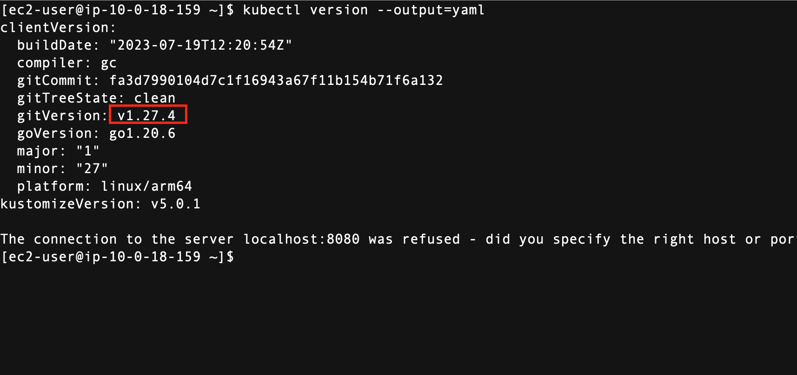

# Install Kubectl

<!-- TOC -->

- [Install Kubectl](#install-kubectl)
  - [Overview](#overview)
  - [Run as sudo](#run-as-sudo)
  - [Install Kubectl](#install-kubectl)
  - [Check installed kubectl](#check-installed-kubectl)
  - [Reference](#reference)

<!-- /TOC -->

## Overview

Install kubectl on your cluster to manage the cluster.

## Run as sudo

```sh
sudo bash
```

## Install Kubectl


```sh

# This is arm64 kubectl
curl -LO "https://dl.k8s.io/release/$(curl -L -s https://dl.k8s.io/release/stable.txt)/bin/linux/arm64/kubectl"
chmod +x ./kubectl
mkdir -p $HOME/bin && cp ./kubectl $HOME/bin/kubectl && export PATH=$HOME/bin:$PATH
echo 'export PATH=$HOME/bin:$PATH' >> ~/.bashrc


```
https://kubernetes.io/docs/tasks/tools/install-kubectl-linux/

## Check installed kubectl


```sh

kubectl version --output=yaml

```




## Reference

- https://docs.aws.amazon.com/eks/latest/userguide/install-kubectl.html