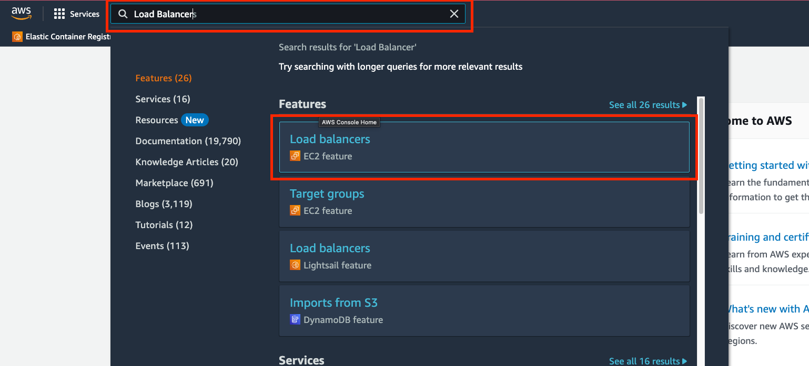
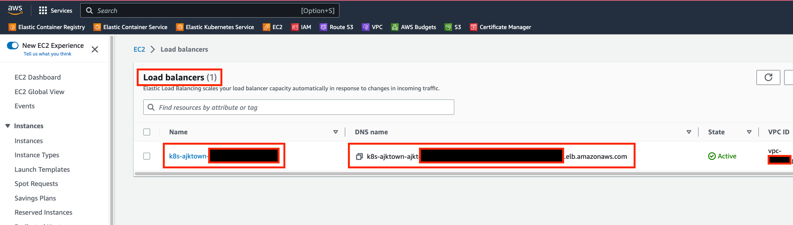

# eksctl setup

<!-- TOC -->

- [eksctl setup](#eksctl-setup)
  - [Overview](#overview)
  - [TODOs](#todos)
  - [Ingress File](#ingress-file)
  - [Apply ingress](#apply-ingress)
  - [How to check ALB on AWS Web Console](#how-to-check-alb-on-aws-web-console)
    - [Search LoadBalacner on Console Search](#search-loadbalacner-on-console-search)
    - [Check Load Balancer](#check-load-balancer)

<!-- /TOC -->

<!-- /TOC -->

## Overview

Ingress is a service that allows you to access your service from outside the cluster.

AWS will detect deployed ingress and will automatically create ALB for each ingress deployed.

The problem is that each ALB costs about $20 per month. (As of 2023)

Therefore, we will use shared ingress for all services of AJK Town, possibly until one alb cannot handle

average requests to AJK Town services.

## TODOs

- [ ] I wonder if you can have a default host that will direct to certain service if no host is specified.
  - I am sure it does!

## Ingress File

Ingress is managed within the same directory with the file name [04_ingress.yaml](./04_ingress.yaml)


## Apply ingress

```sh
kubectl apply -f 04_ingress.yaml
```

Once you apply ingress successfully, the `aws-load-balancer-controller` we have installed previously will detect and create ALB for each ingress.

## How to check ALB on AWS Web Console

### Search LoadBalacner on Console Search



### Check Load Balancer


You can see that the load balancer named `k8s-ajk...` is created.